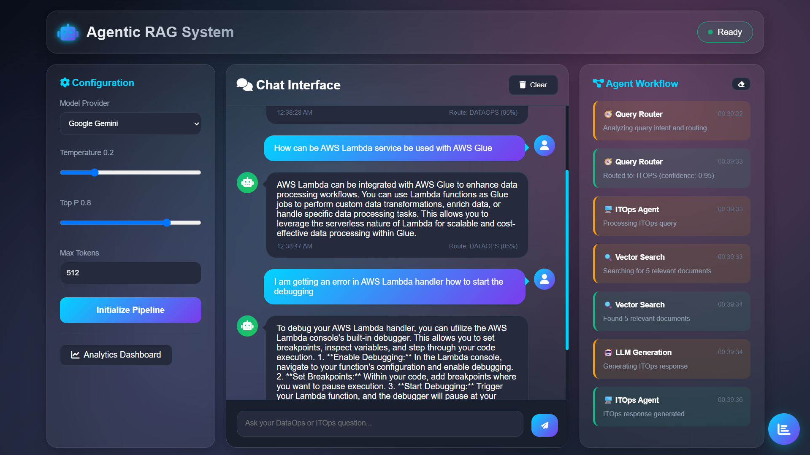
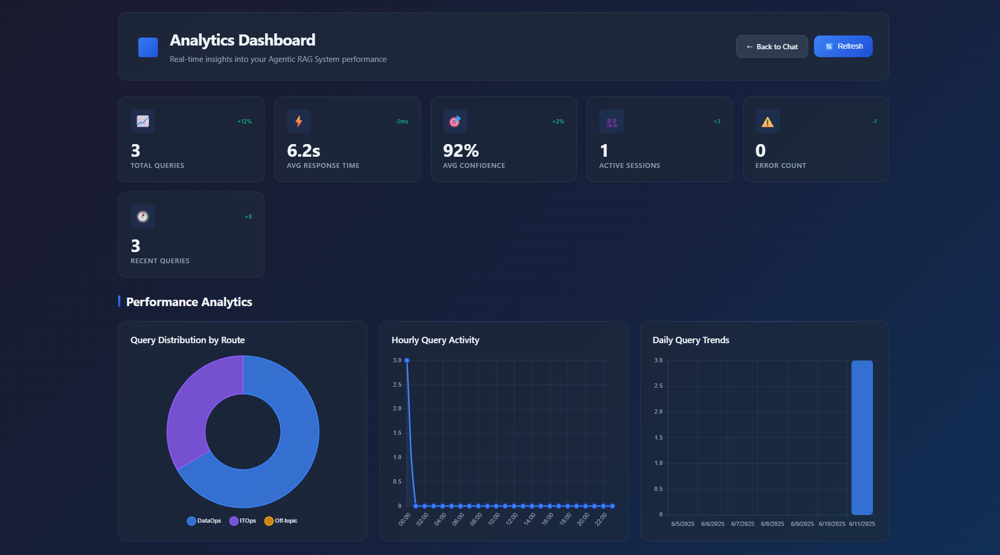

# 🧠 Decision Making Agentic RAG System - Langgraph

Welcome to the **Agentic RAG System**, a Flask-based interactive interface that leverages **Agentic Retrieval-Augmented Generation (RAG)** for intelligent understanding and querying of AWS documentation. This system integrates configurable LLMs, agent workflows, and dual-vector knowledge routing to handle complex enterprise DataOps and ITOps queries.

---
Agentic RAG Home Page
---

---

---
Agentic RAG Analytics Page
---

---

## 🚀 Overview

This application enables users to interactively query AWS documentation using an intelligent agentic architecture. The GUI is designed to streamline the configuration and visualization of a multi-agent RAG system using:

- **Model selection and tuning** (e.g., Google Gemini, OpenAI, etc.)
- **Agentic workflow orchestration**
- **Dual Agetic routing** (for DataOps and ITOps domains)
- **Chat interface for query interaction**
- **Live workflow visualization**
- **Analytics dashboard support**

## 🏗️ Architecture

The system implements a multi-agent architecture with the following components:

- **Query Router Agent**: Classifies the input query into either DataOps or ITOps.
- **DataOps Agent**: Handles queries related to AWS data infrastructure, services, and monitoring.
- **ITOps Agent**: Handles queries related to AWS networking, provisioning, and infrastructure management.
- **LangGraph-based Workflow Engine**: Visualizes and traces the path of agentic decisions.
- **Vector Stores**: Separate Chroma/FAISS stores for DataOps and ITOps knowledge embeddings.

## 🧩 Features

### 🔧 Configuration Panel

- **Model Provider**: Choose between LLM providers (e.g., OpenAI, Google Gemini)
- **Temperature**: Control creativity of responses.
- **Top P (Nucleus Sampling)**: Control diversity in output tokens.
- **Max Tokens**: Limit the response length.

### 💬 Chat Interface

- Friendly chatbot UI for entering natural language AWS queries.
- Clear chat history button.
- Supports both long-form and short-form questions.

### 🧠 Agent Workflow

- Dynamic visualization of how agents interact to resolve your query.
- Workflow appears once the pipeline is initialized and a question is submitted.

## 🙋‍♂️ About the Author

Developed by **Snehan Biswas**, AI Consultant & Agentic RAG Architect.  
Capgemini India | GenAI | LangGraph | Cloud-Native AI Systems

## 📄 License

This project is licensed under the **MIT License**.
